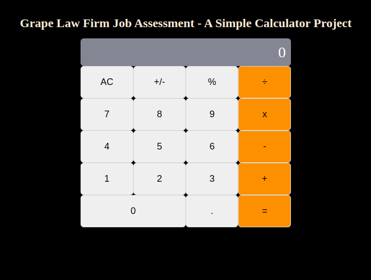

# Grape-Law-Firm-Calculator-Project

This project was bootstrapped with [Create React App](https://github.com/facebook/create-react-app).

### Project Description

This Calculator project is a job assessment test for Grape Law Firm. It is built using HTML, CSS and JavaScript. Its scope is designed to perform an operation on at least two numbers and report basic errors. The project is open for further modifications and improvements.

## Built With

- React
- JavaScript
- HTML and CSS

## Getting Started

**Instructions on setting up your project locally.**
The project could be accessed by visiting the website link.

### `npm start`

Runs the app in the development mode.\
Open [http://localhost:3000](http://localhost:3000) to view it in your browser.

### `npm run build`

Builds the app for production to the `build` folder.\
It correctly bundles React in production mode and optimizes the build for the best performance.

The build is minified and the filenames include the hashes.\
Your app is ready to be deployed!

See the section about [deployment](https://facebook.github.io/create-react-app/docs/deployment) for more information.

## Authors

👤 **Eneh Charles Chukwunweike**

- GitHub: [@charlyeneh](https://github.com/charlyeneh)
- Twitter: [@twitterhandle](https://twitter.com/ProgrammerBaby?s=09)
- LinkedIn: [LinkedIn](https://www.linkedin.com/in/charles-chukwunweike-eneh/)

## 🤝 Contributing

Contributions, issues, and feature requests are welcome!

## Show your support

Give a ⭐️ if you like this project!

## Acknowledgments

- Hat tip to anyone whose code was used
- Inspiration
- etc

## 📝 License

This project is [MIT](./MIT.md) licensed.
